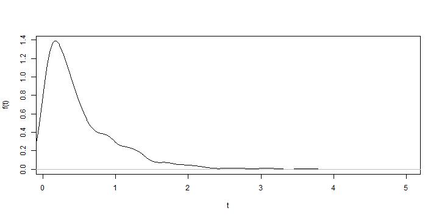
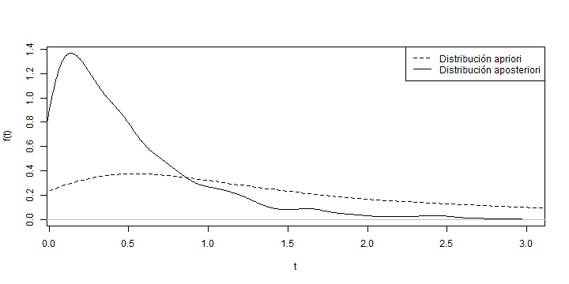

## Contenido

> 1. Confiabilidad.
> 2. Estadística Bayesiana.
> 3. Confiabilidad Bayesiana.

---

## Confiablidad

La confiabilidad es la propiedad de que algo funcione de forma correcta cuando se quiere usar.

Estadísticamente se define como la probabilidad que un sistema funcione de forma adecuada para lo cual fue desarrollado; se establece un período de tiempo y un conjunto de condiciones para su funcionamiento. La confiablidad puede ser expresada como una función del tiempo.

El análisis de confiablidad comúnmente se define bajo respuesta binaria, es decir, éxito/falla; pero es igual de importante analizar los períodos de tiempo, denominados *tiempo de vida* o *tiempo de falla*.

Algunas razones para recolectar datos de Confiabilidad es evaludar las característias de los materiales, predecir el tiempo de falla del producto, comparar con competidores, etc.

Las caractarística de los datos de Confiabilidad pueden ser: datos censurados (se establece un período para el estudio), datos con respuesta binaria (positiva).

---

## Confiabilidad (Cont.)

En la estadística clásica comúnmente se utilizan distribuciones exponencial, lognormal, Weibull, gamma y gamma inversa.

En la figura de abajo podemos observar la función de densidad de probabilidad de una variable aleatoria $exp(2)$:

---

## Confiablidad (Cont.)

En el análisis de Confiabilidad la métrica más usada es su distribución de *tiempo de falla* y los datos de los cuales se tiene información es acerca de los tiempos de falla y variables explicativas que darán información adicional al modelo.

La función de *tiempo de falla* puede ser caracterizada por:

> 1. Función de distribución acumulada: nos da la probabilidad de que una unidad falle en el tiempo $t$ o antes. $$F(t) = P(T \leq t)$$

> 2. Función de densidad de probabilidad: se usa para representar la frecuenca relativa de los tiempos de falla en función del tiempo. $$F(t) = \int_0^t f(x)dx$$

---

## Confiablidad (Cont.)

> 3. Función de supervivencia: también conocida como función de confiabilidad, nos da la probabilidad de que una unidad funcione más allá del tiempo $t$. $$ s(t) = P(T > t) = 1- F(t) = \int_t^{\infty} f(x)dx$$

> 4. Función Hazard: conocida como tasa de riesgo, expresa la posibilidad a fallar en el siguiente intervalo de tiempo definido.

> 5. Y otras como: función de Hazard acumulada, razón Hazard promedio, función cuantil y distribución cualtil.

---

## Estadística Bayesiana

La estadística Bayesiana en los últimos años a tomado mucha fuerza con el desarrollo de la computación dado que es altamente demandante en simulaciones computacionales. Últimamente a tomado mucha relevancia ya que se pueden resolver problemas que con métodos clásicos no ha sido posible.

La implementación de métodos Bayesianos permite representar lo que creemos acerca de los datos en una distribución apriori, luego cuando podemos analizar los datos recolectados lo que creemos va ser actualizado con la distribución aposteriori.

---

## Estadística Bayesiana - Distribución apriori

Las distribuciones apriori se pueden clasificar en:

> 1. Apriori propia: es una distribución que asigna pesos no negativos y que suman o integran hasta uno, a todos los valores posibles del parámetro.

> 2. Apriori No Informativa/Informativa: una distribución apriori no informativa refleja una ignorancia totl o un conocimiento limitado sobre el parámetro de interés. Caso contrario con la informativa, va expresar información que conocemos, la dificultad está en la identificación, selección y justificación de la distribución apriori.

> 3. Apriori Conjugada: al proceder a su actualización mediante la información muestral, la distribución aposteriori es igual a la apriori.

---

## Confiabilidad Bayesiana

En Confiabilidad Bayesiana, la modelación estadística consta de dos partes:

1. La función de verosimilitud: tipicamente construida de la distribución muestral, definida por la función de densidad de probabilidad asumida de la data, de la cual no se conocen los parámetros.
2. La distribución apriori: se obtiene antes de analizar la data experimental y representa el conocimiento que tenemos de los datos.

En el análisis Bayesiano, la *función de verosimilitud* y la *distribución apriori* son la base para la estimación de los parámetros e inferencia.

La estadística Bayesiana permite el uso de información que va más allá de la data experimental, esto se conoce como *probabilidad subjetiva*, por lo general se usa otra información relevante acerca de los parámetros de confiablidad desconocidos. Esta información es extremandamente útil y es un componente muy poderoso en el enfoque Bayesiano.

---

## Confiabilidad Bayesiana (Cont.)

Después que lo datos de la prueba han sido obtenidos, la *distribución aposteriori* describe completamente la incertidumbre asociada a los parámetros; la *distribución aposteriori* se calcula vía **Teorema de Bayes** usando la *función de verosimilitud* y la *distribución apriori*. La sucuencia lógica de los métodos Bayesianos para el análisis de Confiablidad hace que sea fácil de describir, fácil de interpretar y usar.

Un ejemplo de una distribución apriori y una aposteriori se puede ver a continuación.

---

### Bibliografía

J.C. Correa Morales. Introdución a la Estadística Bayesiana. Escuela de Estadística, Universidad Nacional de Colombia, Sede Medellín. 2008.

M.C. Jaramillo Elorza. Notas de clase: Estadística Industrial II. Escuela de Estadística, Universidad Nacional de Colombia, Sede Medellín 2015.

M.S. Hamada, A.G. Wilson, C.S. Reese and H.F. Martz. Bayesian Reliability, Springer Series in Statistics. 2008.
